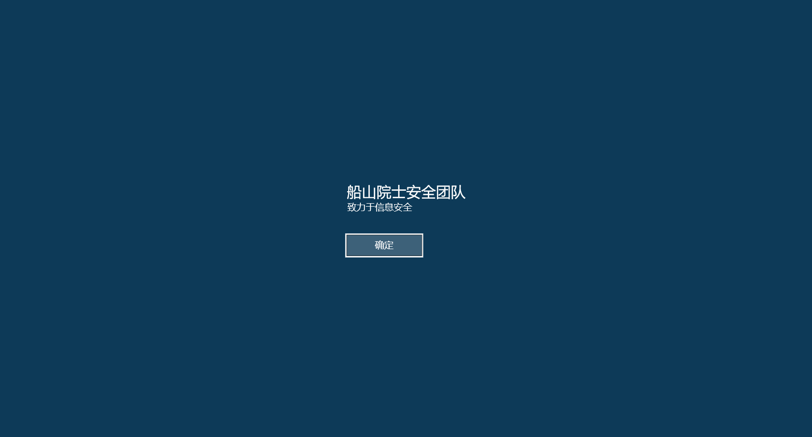
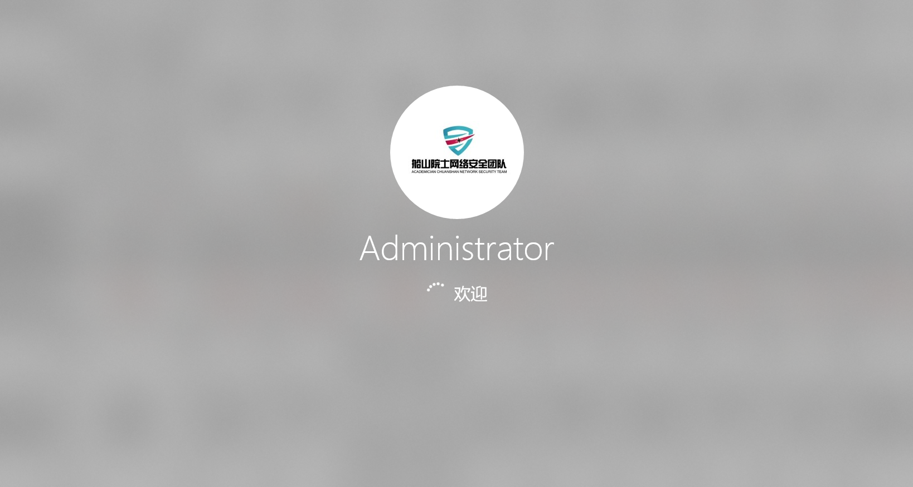
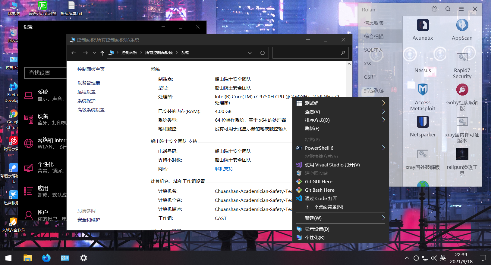
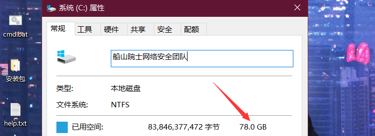

## ACADEMICIAN-CHUANSHAN-NETWORK-SECURITY TEAM

### 介绍

#### 船山院士安全团队渗透测试系统-为渗透提供更多便利

### 版本

#### v1.0测试版

##### 进入页面

桌面

总截图

精简

by 鸭子封包—为船山院士网络安全团队提供（v1.0测试版）

唯一联系方式：tangtang@yazuyazi.cn

# GitHub图片无法打开解决办法 修改本地的hosts文件
#GitHub Start

192.30.253.112    Build software better, together

192.30.253.119     gist.github.com

151.101.184.133     assets-cdn.github.com

151.101.184.133     raw.githubusercontent.com

151.101.184.133     gist.githubusercontent.com

151.101.184.133     cloud.githubusercontent.com

151.101.184.133     camo.githubusercontent.com

151.101.184.133     avatars0.githubusercontent.com

151.101.184.133     avatars1.githubusercontent.com

151.101.184.133     avatars2.githubusercontent.com

151.101.184.133     avatars3.githubusercontent.com

151.101.184.133    avatars4.githubusercontent.com

151.101.184.133     avatars5.githubusercontent.com

151.101.184.133     avatars6.githubusercontent.com

151.101.184.133     avatars7.githubusercontent.com

151.101.184.133     avatars8.githubusercontent.com

#GitHub End
